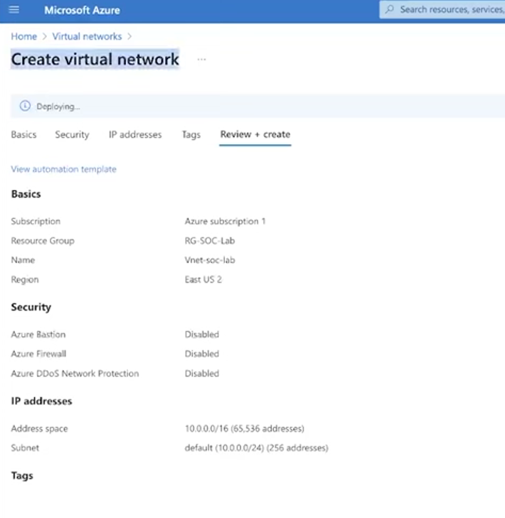
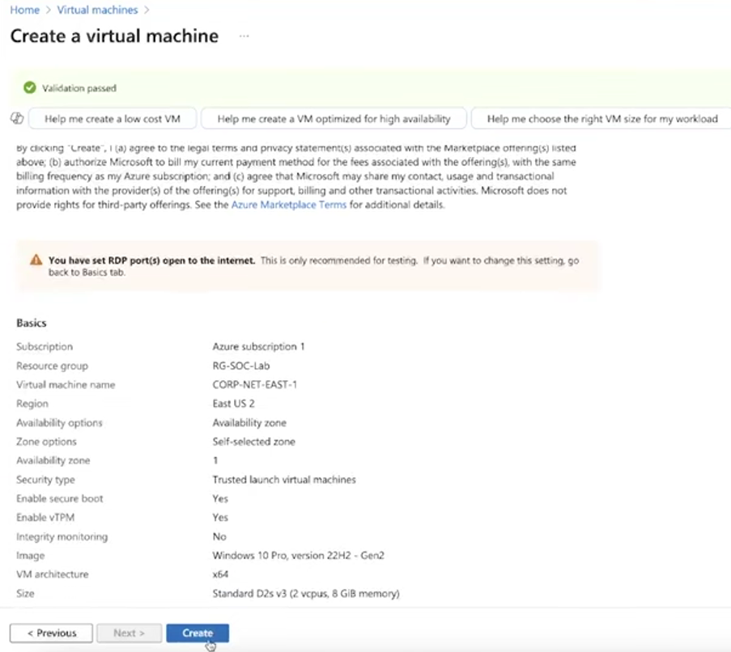
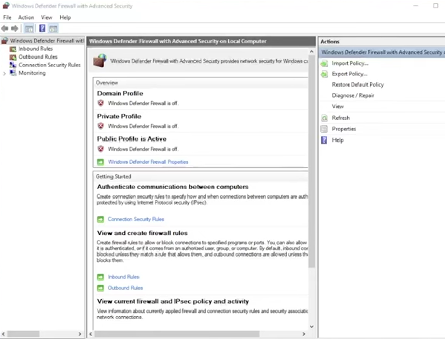
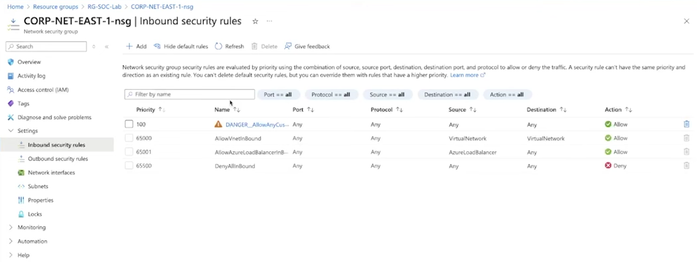
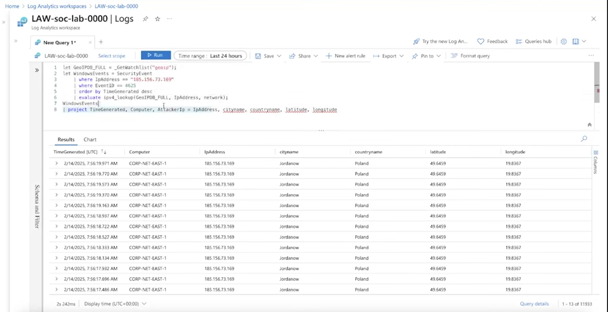
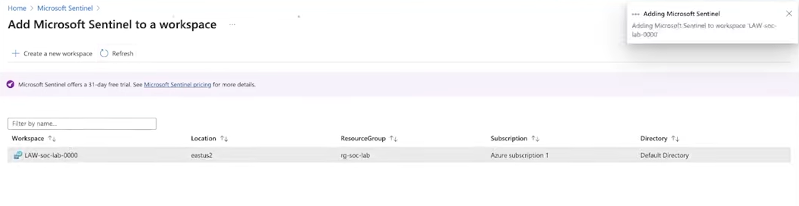
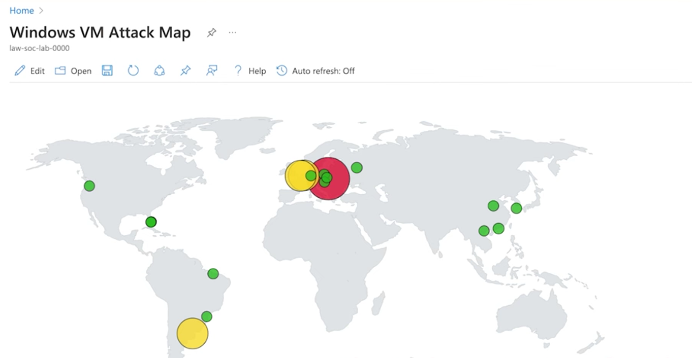

# ☁️ Azure Honeypot Lab – Public VM Exposure & SIEM Monitoring

## 📌 Project Objective

The goal of this lab was to deploy a vulnerable Windows virtual machine in Microsoft Azure, intentionally expose it to the public internet, and monitor real-world attack attempts using Microsoft Sentinel.

This simulates a real SOC scenario where analysts monitor authentication logs, identify attackers, and visualize global attack activity.

---

## 🛠 Tools & Technologies Used

- Microsoft Azure
- Azure Subscription
- Azure Virtual Network (VNet)
- Azure Virtual Machine (Windows 10)
- Network Security Group (NSG)
- Windows Defender Firewall
- Log Analytics Workspace
- Microsoft Sentinel (SIEM)
- Kusto Query Language (KQL)
- Remote Desktop Protocol (RDP)

---

# 🧾 Step 1 – Create Azure Subscription & Resource Group

An Azure subscription was created to host all cloud resources for this lab.

A dedicated Resource Group (`RG-SOC-Lab`) was then created to organize and manage all deployed resources in one location.

This ensures all infrastructure components are logically grouped and easy to manage.

---

# 🌐 Step 2 – Create Virtual Network

### Explanation

A new Azure Virtual Network was created to host the Windows virtual machine.

Configuration details:

- VNet Name: `vnet-soc-lab`
- Region: East US 2
- Address Space: `10.0.0.0/16`
- Subnet: `10.0.0.0/24`

This network provides internal addressing and isolates the lab environment within Azure.

---

# 💻 Step 3 – Deploy Windows Virtual Machine

### Explanation

A Windows 10 Pro virtual machine was deployed inside the virtual network.

Key details:

- VM Name: `CORP-NET-EAST-1`
- Size: Standard D2s v3
- Public RDP Port Enabled

Azure generated a warning stating that RDP was open to the internet.  
This was intentional for honeypot purposes.

The VM was assigned a public IP address so it could receive traffic from the internet.

---

# 🔓 Step 4 – Disable Firewall Protections Inside the VM

### Explanation

After connecting to the VM via RDP, Windows Defender Firewall was disabled for:

- Domain Profile
- Private Profile
- Public Profile

This intentionally removed host-based protections to increase vulnerability.

---

## Modify Network Security Group (NSG)

### Explanation

The Network Security Group was configured to allow inbound traffic from any source.

Notice the rule:

- Name: `DANGER_AllowAnyCus`
- Source: Any
- Destination: Any
- Action: Allow

This ensures the VM is fully exposed to global scanning and brute-force attempts.

---

# 🖥 Step 5 – Verify Access (RDP & Connectivity Test)

After disabling firewall protections:

- RDP connectivity was verified
- The machine was successfully accessed remotely
- The VM was pinged externally to confirm it was online and reachable

This confirmed the honeypot was fully exposed and operational.

---

# 📊 Step 6 – Run KQL Query to Analyze Attack Attempts

### Explanation

The VM was connected to a Log Analytics Workspace (`LAW-soc-lab-0000`) to collect Windows Security Event logs.

We ran a KQL query filtering:

- Event ID 4625 (Failed Logins)
- Extracted attacker IP addresses
- Enriched IP data with geographic lookup

The query displayed:

- Attacker IP addresses
- City
- Country
- Latitude & Longitude

This allowed us to identify where attackers were attempting to log in from.

---

# 🛡 Step 7 – Connect Log Analytics Workspace to Microsoft Sentinel

### Explanation

The Log Analytics Workspace was connected to Microsoft Sentinel.

This converted the environment into a cloud-based SIEM platform capable of:

- Log aggregation
- Threat detection
- Investigation
- Visualization

Sentinel centralizes all security telemetry in one place.

---

# 🌍 Step 8 – Create Global Attack Map Visualization

### Explanation

Using enriched log data, an attack map was created to visually display where login attempts originated.

The map shows:

- Geographic clustering of attackers
- Volume of attempts per region
- Global distribution of brute-force activity

Within hours of exposure, the machine received login attempts from multiple countries across:

- Europe
- Asia
- North America
- South America

This demonstrates how quickly internet-facing systems are scanned and targeted.

---

# 📌 Conclusion

This lab demonstrates how rapidly publicly exposed systems attract malicious traffic. By intentionally disabling firewall protections and allowing unrestricted inbound access, the virtual machine became a target for automated brute-force login attempts.

Using Azure Log Analytics and Microsoft Sentinel, we were able to:

- Capture authentication failures
- Identify attacker IP addresses
- Enrich logs with geographic intelligence
- Visualize global attack patterns

This project highlights the importance of proper firewall configurations, network security groups, and centralized SIEM monitoring in cloud environments.

---

# 🔑 Key Takeaways

- Public RDP exposure results in immediate brute-force attempts
- Disabling firewall protections drastically increases attack surface
- NSG rules directly impact cloud security posture
- SIEM platforms provide centralized visibility into authentication events
- KQL enables detailed attack investigation and geographic enrichment
- Cloud systems must be hardened to prevent unauthorized access
