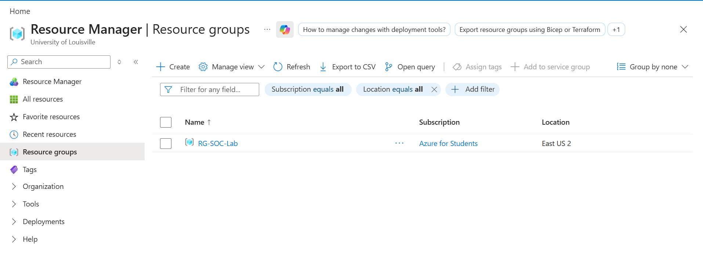

# ☁️ Azure Honeypot Lab – Public VM Exposure & SIEM Monitoring

## 📌 Project Objective

The goal of this lab was to deploy a vulnerable Windows virtual machine in Microsoft Azure, intentionally expose it to the public internet, and monitor real-world attack attempts using Microsoft Sentinel.

This simulates a real SOC scenario where analysts monitor authentication logs, identify attackers, and visualize global attack activity.

---

## 🛠 Tools & Technologies Used

- Microsoft Azure
- Azure Subscription (Azure for Students)
- Azure Virtual Network (VNet)
- Azure Virtual Machine (Windows 10)
- Network Security Group (NSG)
- Windows Defender Firewall
- Log Analytics Workspace
- Microsoft Sentinel (SIEM)
- Kusto Query Language (KQL)
- Remote Desktop Protocol (RDP)

---

# 🧾 Step 1 – Create Azure Subscription & Resource Group

### Explanation

An Azure for Students subscription was used to deploy the lab infrastructure.

A dedicated Resource Group (`RG-SOC-Lab`) was created in:

- Region: East US 2

The Resource Group acts as a logical container that holds all cloud resources for this lab, including:

- Virtual Network
- Virtual Machine
- Network Security Group
- Log Analytics Workspace
- Microsoft Sentinel

This keeps all components organized and easy to manage.

---

# 🌐 Step 2 – Create Virtual Network

### Explanation

A new Azure Virtual Network was created to host the Windows virtual machine.

Configuration details:

- VNet Name: `vnet-soc-lab`
- Region: East US 2
- Address Space: `10.0.0.0/16`
- Subnet: `10.0.0.0/24`

This virtual network provides internal IP addressing and isolates the lab environment inside Azure.

---

# 💻 Step 3 – Deploy Windows Virtual Machine

### Explanation

A Windows 10 Pro virtual machine was deployed inside the virtual network.

Key configuration details:

- VM Name: `CORP-NET-EAST-1`
- Size: Standard D2s v3
- Public IP Address Assigned
- RDP (Port 3389) Enabled to Internet

Azure generated a warning indicating RDP was open to the public internet.  
This was intentional to simulate a vulnerable external-facing system.

---

# 🔓 Step 4 – Disable Firewall Protections Inside the VM

## Windows Defender Firewall Disabled

### Explanation

After connecting via RDP, Windows Defender Firewall was disabled for:

- Domain Profile
- Private Profile
- Public Profile

This intentionally removed host-based protection, increasing the system’s exposure to external attacks.

---

## Modify Network Security Group (NSG)

### Explanation

The Network Security Group was configured to allow inbound traffic from any source.

Notice the rule:

- Name: `DANGER_AllowAnyCus`
- Source: Any
- Destination: Any
- Action: Allow

This ensured the VM was fully exposed to internet scanning and brute-force attempts.

---

# 🖥 Step 5 – Verify Connectivity (RDP & Ping Test)

After disabling firewall protections:

- RDP connectivity was verified successfully
- The system was accessible remotely
- The VM was pinged externally to confirm it was online and reachable

This confirmed the honeypot was operational and exposed.

---

# 📊 Step 6 – Run KQL Query to Analyze Attack Attempts

### Explanation

The VM was connected to a Log Analytics Workspace (`LAW-soc-lab-0000`) to collect Windows Security logs.

A KQL query was executed to filter:

- Event ID 4625 (Failed Logins)
- Attacker IP addresses
- Geographic location data

The results showed:

- Attacker IP
- City
- Country
- Latitude & Longitude

This allowed identification of where brute-force attempts were originating.

---

# 🛡 Step 7 – Connect Log Analytics Workspace to Microsoft Sentinel

### Explanation

Microsoft Sentinel was added to the Log Analytics Workspace.

This converted the environment into a cloud-based SIEM platform capable of:

- Centralized log collection
- Threat investigation
- Event correlation
- Security visualization

Sentinel provides real-time monitoring and analysis capabilities.

---

# 🌍 Step 8 – Create Global Attack Map Visualization

### Explanation

Using enriched log data, an attack map was created to visually display global attack sources.

The map shows:

- Geographic clustering of attackers
- Volume of attempts per region
- Worldwide brute-force activity

Within hours of exposure, the system received login attempts from multiple countries across Europe, Asia, North America, and South America.

This demonstrates how quickly internet-facing systems become targets.

---

# 📌 Conclusion

This lab demonstrates how rapidly publicly exposed systems attract malicious traffic. By intentionally disabling firewall protections and allowing unrestricted inbound access, the virtual machine immediately became a target for automated brute-force login attempts.

Using Azure Log Analytics and Microsoft Sentinel, we were able to:

- Capture failed authentication attempts
- Identify attacker IP addresses
- Enrich logs with geographic intelligence
- Visualize global attack patterns

This project highlights the importance of proper firewall configuration, hardened NSG rules, and centralized SIEM monitoring in cloud environments.

---

# 🔑 Key Takeaways

- Public RDP exposure results in immediate brute-force activity
- Disabling firewall protections drastically increases attack surface
- NSG rules directly impact cloud security posture
- SIEM tools provide centralized visibility into authentication events
- KQL enables detailed attack analysis and geolocation enrichment
- Cloud systems must be hardened to prevent unauthorized access
